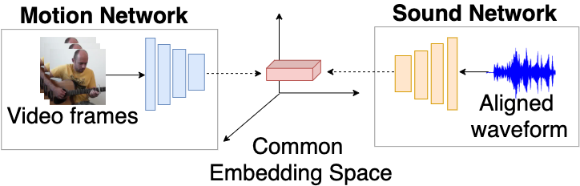

# Visually Guided Sound Source Separation and Localization using Self-Supervised Motion Representations

[Paper](https://openaccess.thecvf.com/content/WACV2022/papers/Zhu_Visually_Guided_Sound_Source_Separation_and_Localization_Using_Self-Supervised_Motion_WACV_2022_paper.pdf) | [project](https://ly-zhu.github.io/self-supervised-motion-representations/)


This repository contains PyTorch implementation of "Visually Guided Sound Source Separation and Localization using Self-Supervised Motion Representations". Authors: [Lingyu Zhu](https://ly-zhu.github.io) and [Esa Rahtu](http://esa.rahtu.fi). Tampere University, Finland.

The implementation of the Audio-Motion Embedding (AME) framework is available (26.09.2022)





# Datasets

-The original MUSIC-21 dataset can be downloaded from: https://github.com/roudimit/MUSIC_dataset.

# Training

./scripts/train_AME.sh


# Visualization

./scripts/vis_AME.sh


# Reference

[1] Owens, Andrew, and Alexei A. Efros. "Audio-visual scene analysis with self-supervised multisensory features." Proceedings of the European Conference on Computer Vision (ECCV). 2018.

[2] Zhao, Hang, et al. "The sound of pixels." Proceedings of the European conference on computer vision (ECCV). 2018.

[3] Zhao, Hang, et al. "The sound of motions." Proceedings of the IEEE/CVF International Conference on Computer Vision (ICCV). 2019.


## Citation

If you find this work useful in your research, please cite:


```bibtex   
@inproceedings{zhu2022visually,
  title={Visually guided sound source separation and localization using self-supervised motion representations},
  author={Zhu, Lingyu and Rahtu, Esa},
  booktitle={Proceedings of the IEEE/CVF Winter Conference on Applications of Computer Vision},
  pages={1289--1299},
  year={2022}
}
```

# Acknowledgement
This repo is developed based on [Sound-of-Pixels](https://github.com/hangzhaomit/Sound-of-Pixels).
